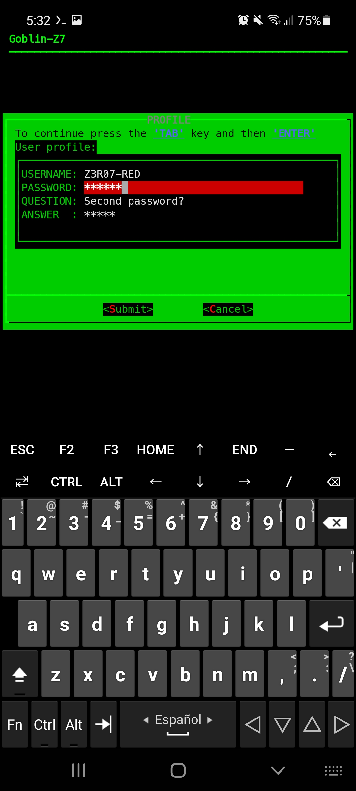
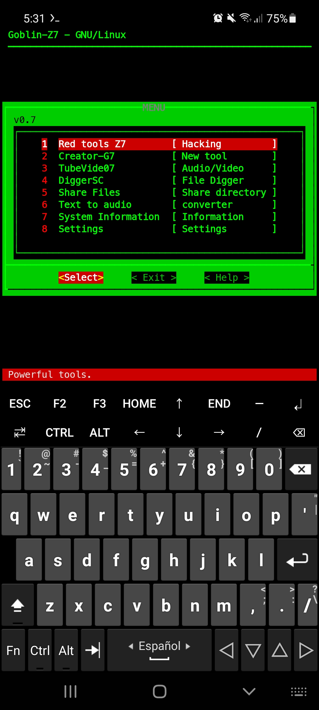
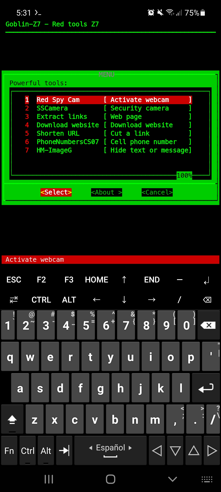

<p align="center">

</p>

<p align="center">
<a href="https://github.com/Z3R07-RED"></a>
<a href=""></a>
</p>

<p align="center">
<a href="https://youtube.com/channel/UC9RNHWC3CFapIkmmXS8qYDQ"></a>
</p>

<p align="center">


</p>

**Goblin-Z7** It is still in its `beta` version, little by little new tools will be added so always keep the tool updated.

Previous requirements:
======
The following system-level utilities need to be installed:

* KALI LINUX

```
apt-get install dialog
```
```
apt-get install python2 -y
```
```
apt-get install python3 -y
```
```
apt-get install python3-pip
```
```
apt-get install proxychains
```

* TERMUX

```
apt install dialog
```
```
apt install python -y
```
```
apt install python2 -y
```
```
apt install proxychains-ng
```

Once installed, you can proceed to the next point.

```
git clone https://github.com/Z3R07-RED/Goblin-Z7.git
```

# Enter directory:

`cd Goblin-Z7/`

# we give execution permissions:

`chmod +x goblin-z7.sh`

`chmod +x requirements.txt`

# Requirements:

```
pip3 install -r requirements.txt
```

# Finally execute the script:

**NOTE** For your security, activate the `tor` server from another window.

# Kali Linux:

`sudo su`

`bash goblin-z7.sh`

# Termux:

```
./goblin-z7.sh
```
<h2 align="center"> Screenshots: </h2>

|    REGISTRY    |          MENU          |       TOOLS       |
| -------------- | ---------------------- | ----------------  |
||||

